# ✈️ 오사카 3인 가족 여행 일정 계획표 (2박 3일)
- **일정**: 2026년 9월 18일(금) ~ 9월 20일(일) [2박 3일]
- **인원**: 3명 (오빠, 나, 어머니)
- **숙소**: KOKO 호텔 오사카 난바
- **교통 & 패스**: 첫째 날 오사카 1일 패스(주유패스 또는 e-pass 등) 적극 활용

---

## 🗓️ 1일차: 9월 18일 (금) - 덴포잔 패스 투어, 오사카성 & 츠텐카쿠 (원조 타코야끼 & 추천 카페)
> **[동선 포인트]** 
> 첫째 날은 오사카 1일 패스를 사용해 무료 입장 혜택을 극대화합니다. 공항에서 바로 관광지로 가면 캐리어 때문에 어머니의 체력 소모가 크므로, 숙소에 짐을 먼저 보관하고 이동하는 효율적인 루트입니다. 
> 관광 일정이 타이트하므로 덴포잔과 오사카성 숲길 사이에 분위기 좋은 틈새 카페 2곳을 배치하고, 덴포잔 코스 중간에 원조 타코야끼인 '아이즈야'를 배치해 즐거움을 더했습니다.

### 🕙 09:00 ~ 10:30 | 오사카 입국 및 551호라이
- **간사이 국제공항(KIX) 도착** 후 입국 수속
- 공항 내 [551 호라이 만두](https://www.google.com/maps/search/?api=1&query=551+Horai+Kansai+Airport)에서 부타만(왕만두) 포장
- **난카이 특급 라피트** 탑승 ➔ 난바역 하차 (이동 중 열차 안에서 가볍게 만두 시식)

### 🕚 10:30 ~ 12:00 | 크루즈 예매 및 호텔 짐 보관
- 도톤보리 돈키호테 앞 매표소에서 저녁에 탑승할 [톤보리 리버크루즈](https://www.google.com/maps/search/?api=1&query=Tombori+River+Cruise)를 1일 패스 혜택으로 사전 예매
- [KOKO 호텔 오사카 난바](https://www.google.com/maps/search/?api=1&query=KOKO+HOTEL+Osaka+Namba)로 이동하여 체크인 전 프런트에 캐리어 보관 위탁

### 🕛 12:00 ~ 15:00 | 오전/점심 코스: 덴포잔 (오사카 1일 패스 개시)
- *이동*: 난바/닛폰바시역 ➔ 사카이스지혼마치역 환승 ➔ 오사카코역 (약 25분)
- 🎡 **덴포잔 관광 및 점심 식사**:
  1. [덴포잔 대관람차](https://www.google.com/maps/search/?api=1&query=Tempozan+Giant+Ferris+Wheel+Osaka): 공중에서 바다 뷰 감상.
  2. 🍽️ **점심 식사 (오므라이스)**: [북극성 오므라이스 덴포잔점](https://www.google.com/maps/search/?api=1&query=Hokkyokusei+Tempozan+Osaka) (구글 평점 4.0)
     - 1922년 창업한 일본 최초 오므라이스 원조 맛집. 촉촉하고 부드러워 어머니 동반 강력 추천.
  3. 🐙 **[간식/타코야끼]**: [아이즈야 덴포잔점](https://www.google.com/maps/search/?api=1&query=Aizuya+Tempozan+Osaka) (구글 평점 4.0)
     - 타코야끼의 시초! 소스나 마요네즈 없이 짭조름한 육수 맛으로 먹는 담백하고 고소한 한입 크기 원조 타코야끼.
  4. [산타마리아 리버크루즈(범선형 크루즈)](https://www.google.com/maps/search/?api=1&query=Santa+Maria+Cruise+Osaka): 바닷바람을 맞으며 크루즈 탑승.
  5. [지라이언 뮤지엄](https://www.google.com/maps/search/?api=1&query=GLION+MUSEUM+Osaka): 클래식 카 박물관 관람.
- ☕ **[추천 카페 1]** [지라이언 카페 (Café 1923)](https://www.google.com/maps/search/?api=1&query=Cafe+1923+Osaka)
  - 지라이언 뮤지엄 옆 붉은 벽돌 창고 내부의 이색 명차 뷰 카페.

### 🕒 15:00 ~ 17:30 | 오후 코스: 호텔 체크인 & 오사카성
- *이동*: 덴포잔에서 호텔로 복귀 후 15:00 체크인 (가벼운 휴식)
- *이동*: 닛폰바시역 ➔ 다니마치욘초메역 또는 모리노미야역 (약 20분)
- 🏯 **오사카성 관람**:
  - [오사카성 천수각](https://www.google.com/maps/search/?api=1&query=Osaka+Castle) 내부 관람 및 성곽 공원 주변 여유롭게 산책.
  - *선택 옵션*: 시간 여유가 있으면 [우메다 공중정원](https://www.google.com/maps/search/?api=1&query=Umeda+Sky+Building+Kuchu+Teien+Observatory) 야경 관람 추가.
- ☕ **[추천 카페 2]** [R Baker (알 베이커) 오사카성 공원점](https://www.google.com/maps/search/?api=1&query=R+Baker+Osaka+Castle+Park)
  - 숲에 둘러싸인 정원 뷰 테라스 카페. 숲속에서 맑은 공기를 마시며 힐링하기 최적.

### 🕕 17:30 ~ 19:30 | 저녁 코스: 신세카이 & 츠텐카쿠 야경 (가챠 & 쿠시카츠)
- *이동*: 다니마치욘초메역 ➔ 동물원앞역 하차 (약 15분)
- 🗼 [츠텐카쿠](https://www.google.com/maps/search/?api=1&query=Tsutenkaku+Osaka) 및 신세카이 레트로 상점가 구경 (길거리 가챠 샵 구경)
- 🍽️ **식사 (쿠시카츠)**: [야에카츠](https://www.google.com/maps/search/?api=1&query=Yaekatsu+Osaka) 등에서 원조 쿠시카츠 가볍게 시식.
- 🍙 **[포장]**: [오니기리 고리짱 에비스요코초점](https://www.google.com/maps/search/?api=1&query=Onigiri+Gorichan+Ebisu+Yokocho+Osaka)에서 큼직한 주먹밥 포장 (2일차 아침용).

### 🕖 19:30 ~ | 본저녁 스키야키 & 2차 이자카야
- 🍽️ **저녁 식사 (스키야키)**: [스키야키 호쿠토](https://www.google.com/maps/search/?api=1&query=Sukiyaki+Hokuto+Osaka)에서 정통 스키야키 만찬.
- 🍺 **2차 이자카야**: KOKO 호텔 근처 [숯불구이 유지로](https://www.google.com/maps/search/?api=1&query=炭焼きゆうじろう+Sennichimae+Osaka)에서 야키토리와 사케.
- 🏪 **[편의점]**: 복귀 길에 편의점에 들러 야식 및 내일 아침 음료수 구매.

---

## 🗓️ 2일차: 9월 19일 (토) - 일일 버스 투어 & 도톤보리 타코야끼 & 야키니쿠 만찬
> **[동선 포인트]** 
> 투어 버스 승하차지인 '츠루통탄 소에몬초점 앞'은 KOKO 호텔에서 도보 5~10분 거리에 있어, 아침 출발과 저녁 하차 시 동선 낭비와 체력 소모가 전혀 없습니다.
> 버스 투어가 끝난 직후, 저녁 식사인 야키니쿠를 먹으러 가기 전 도톤보리 중심가에서 가장 핫한 타코야끼 맛집 '쿠쿠루'를 동선 상에 추가했습니다.

### 🕖 07:00 ~ 08:00 | 아침 식사 및 출발 준비
- 어제 포장해 둔 오니기리 고리짱 주먹밥과 편의점 음식으로 객실에서 든든하게 아침 식사.

### 🕗 08:00 ~ 19:30 | 일일 버스 투어 (교토 코스)
- [소에몬쵸 츠루통탄 앞](https://www.google.com/maps/search/?api=1&query=Tsurutontan+Soemoncho+Osaka) 미팅 장소로 이동하여 탑승 및 출발.
- 버스 투어 일정 소화 (아라시야마 ➔ 금각사 ➔ 청수사 ➔ 여우신사).

### 🕖 19:30 ~ | 투어 하차 후 도톤보리 타코야끼 & 야키니쿠 만찬
- 버스 하차지(츠루통탄 앞)에서 내린 후 도톤보리 중심가로 이동.
- 🐙 **[간식/타코야끼]**: [타코야끼 쿠쿠루 본점](https://www.google.com/maps/search/?api=1&query=Takoya+Dotonbori+Kukuru+Main+Store+Osaka) (구글 평점 4.0)
  - 입에서 사르르 녹아내리는 극상의 부드러운 식감과 커다란 문어가 듬뿍 들어간 도톤보리 대표 타코야끼.
- 🍽️ **저녁 식사 (야키니쿠 무한리필)**: [야키니쿠 리키마루 도톤보리점](https://www.google.com/maps/search/?api=1&query=Yakiniku+Rikimaru+Dotonbori+Osaka)
  - 하루의 피로를 고품질 야키니쿠로 든든하게 채우는 시간 (예약 필수).
  - *대체 식사*: 따뜻한 면발을 좋아하시는 어머니를 위해 하차지 앞 [츠루통탄 소에몬쵸점](https://www.google.com/maps/search/?api=1&query=Tsurutontan+Soemoncho+Osaka)의 세숫대야 우동도 훌륭한 대안입니다.
- 🏪 **[편의점]**: 야식을 구입하여 숙소 복귀.

---

## 🗓️ 3일차: 9월 20일 (일) - 그릇거리 쇼핑 & 겉바속촉 타코야끼, 장어덮밥 & 디저트 후 출국
> **[동선 포인트]** 
> 3일차 오전에는 예쁜 일본 식기를 쇼핑할 수 있는 그릇거리를 방문하며 바로 입구에 위치한 현지인 1위 타코야끼 맛집 '와나카'를 들릅니다. 오후에는 난바 파크스 내의 초대형 가챠샵과 하브스 케이크를 먹은 뒤 출국합니다.

### 🕘 09:30 ~ 12:00 | 체크아웃 & 아침 식사 & 그릇 쇼핑 & 타코야끼
- 호텔 체크아웃 후 난바역 코인라커 또는 숙소에 캐리어를 보관.
- 🍽️ **아침 식사**: [잇푸도 난바점](https://www.google.com/maps/search/?api=1&query=Ippudo+Namba+Osaka)에서 따끈한 돈코츠 라멘으로 식사.
- 🛍️ **[주방용품 쇼핑]**: [센니치마에 도구야스지 상점가(그릇거리)](https://www.google.com/maps/search/?api=1&query=Sennichimae+Doguyasuji+Shopping+Street+Osaka) 구경.
  - 아기자기한 일본식 그릇, 예쁜 접시, 유리 맥주잔, 사케 독구리 잔 등 쇼핑.
- 🐙 **[간식/타코야끼]**: [타코야키 도라쿠 와나카 센니치마에 본점](https://www.google.com/maps/search/?api=1&query=Takoyaki+Doraku+Wanaka+Sennichimae+Osaka) (구글 평점 4.2)
  - 그릇거리 입구에 바로 위치. 겉은 바삭하고 속은 촉촉한 '겉바속촉'의 정석이자 현지인들이 가장 사랑하는 최고의 타코야끼 맛집.
- ☕ **[추천 카페 3]**: [마루후쿠 커피점 센니치마에 본점](https://www.google.com/maps/search/?api=1&query=Marufuku+Coffee+Sennichimae+Osaka)
  - 1934년 창업, 앤티크한 분위기 속 쌉싸름한 융드립 커피와 핫케이크 맛집.

### 🕛 12:00 ~ 15:30 | 점심 식사(장어덮밥/규카츠) & 대형 가챠샵 & 디저트
- 🍽️ **점심 식사 (장어덮밥 또는 규카츠)**:
  - [장어의 나카쇼 신사이바시점](https://www.google.com/maps/search/?api=1&query=Unagi+no+Nakasho+Shinsaibashi+Osaka): 정통 히츠마부시(장어덮밥)로 든든한 고급 보양 점심.
  - 또는 [규카츠 모토무라 난바점](https://www.google.com/maps/search/?api=1&query=Gyukatsu+Motomura+Namba+Osaka): 화로에 직접 구워 먹는 부드러운 규카츠.
- 🛍️ **[대형 가챠숍]**: 가샤폰 반다이 오피셜 숍 (난바 파크스 5층)에서 다양한 캡슐 토이 구경.
- ☕ **[추천 카페 4/디저트]**: [하브스 난바파크스점](https://www.google.com/maps/search/?api=1&query=HARBS+Namba+Parks+Osaka)에서 과일 밀크 크레이프 케이크 시식.
- 🧸 **[틈새 가챠]**: 호텔 근처이자 서브컬처 중심지인 **덴덴타운** 거리 가챠 샵들 구경.

### 🚀 15:30 ~ | 짐 찾기 및 귀국길
- 난바역 혹은 호텔에서 보관한 캐리어를 찾음.
- **난카이 특급 라피트** 탑승 ➔ 간사이 국제공항 이동.
- 공항 도착 및 19:45 서울행 비행기 탑승, 귀국.

---

## 🏪 일본 편의점 필수 실물 사진 & 꿀조합 리스트
어머니, 오빠와 함께 매일 밤 숙소로 복귀할 때 들르기 좋은 편의점별 실물 제품 사진과 피로를 풀어줄 꿀조합입니다. (일본 매장 진열대에서 사진과 직접 대조하여 찾으시면 매우 수월합니다!)

### 🟢 LAWSON (로손 개별 실물 제품군)
- **모찌뿌요 (Mochi Puyo)**
  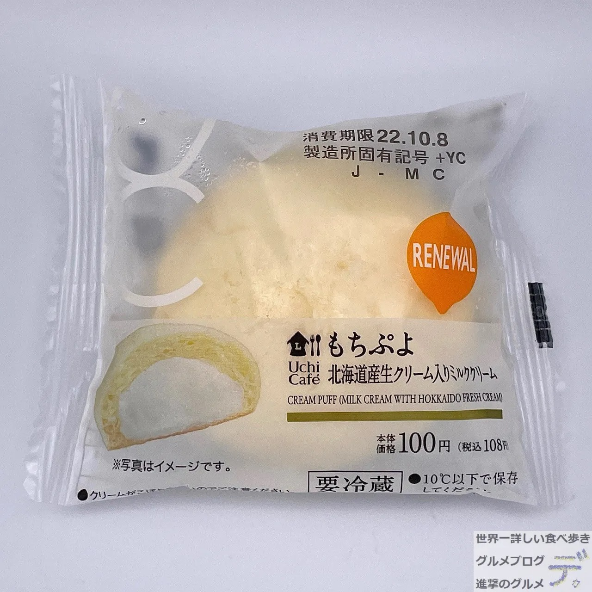
  쫀득쫀득한 찹쌀떡 식감의 반죽 속에 달달한 밀크 커스터드 생크림이 가득 찬 인기 한입 디저트.
- **가라아게군**
  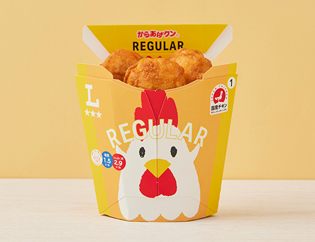
  카운터 옆 온장고에서 즉시 구매 가능한 닭튀김 (매콤한 레드맛 또는 치즈맛 추천).
- **타마고 샌드위치 (계란 샌드)**
  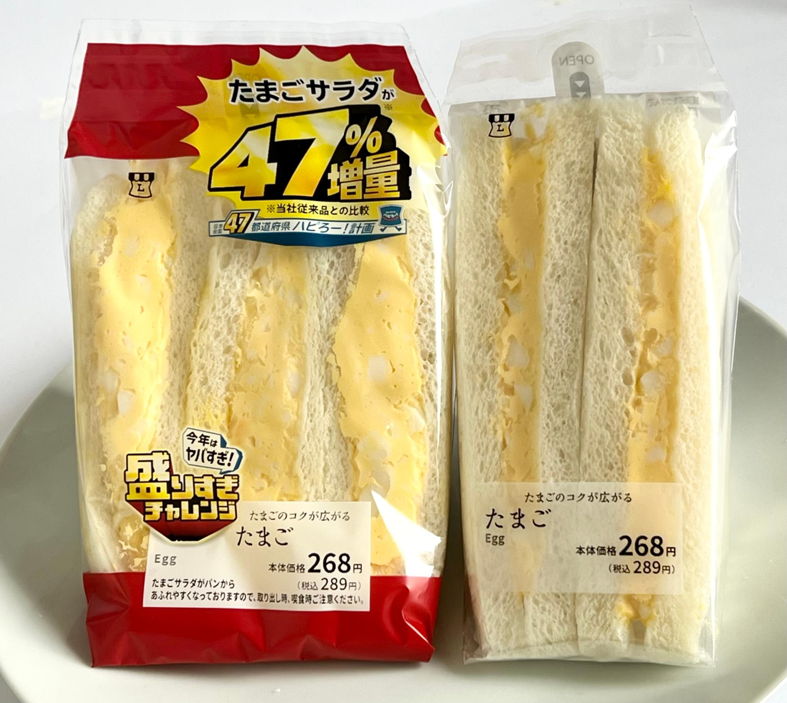
  로손 특유의 매우 부드럽고 쌉싸름하지 않으며 고소한 계란 마요 샌드위치.
- **연어알 주먹밥 (이쿠라 오니기리)**
  간장에 가볍게 절여 톡톡 터지는 고급 생연어알 주먹밥.
- **과일 믹스 샌드위치**
  상큼한 제철 과일과 생크림이 예쁘게 샌드된 달콤한 과일 샌드.
- **오코노미야키 & 야키소바 세트**
  오사카 대표 철판 요리 오코노미야키와 야키소바를 함께 채운 가성비 도시락.
- **까르보나라 우동**
  베이컨 칩이 가미된 진하고 고소한 치즈 크림소스에 쫄깃하고 통통한 우동 면을 맛보는 제품.

### 🔵 FamilyMart (패밀리마트 개별 실물 제품군)
- **파미치키 호네나시 (순살 파미치키)**
  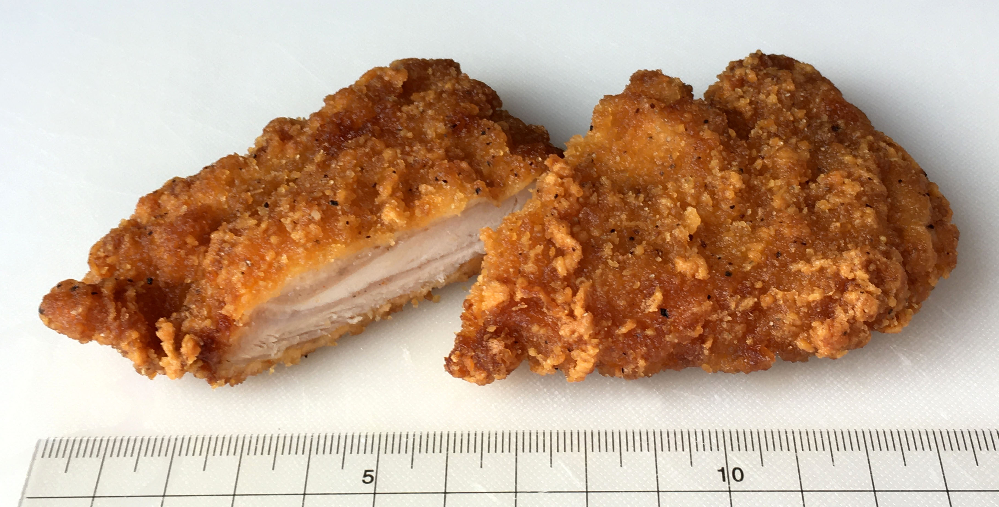
  뼈가 없어 먹기 편하고 한 입 물면 육즙이 가득한 베스트셀러 순살 프라이드 치킨.
- **수플레 푸딩**
  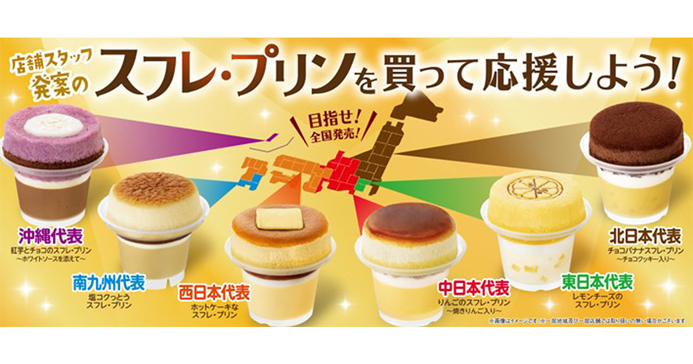
  푹신한 치즈 수플레 케이크 아래에 부드럽고 달콤한 커스터드 푸딩이 얹어진 최강의 콤보 디저트.
- **야키소바 빵**
  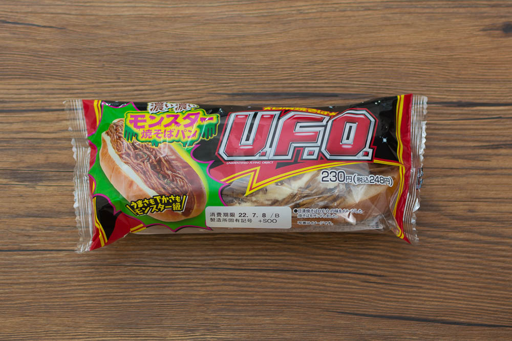
  짭조름한 소스에 볶은 야키소바 면을 부드러운 핫도그 빵에 채워 넣은 원조 단짠 빵.
- **타마고 산도 (계란 샌드위치)**
  노란 계란 마요 앙금이 빈틈없이 들어가 고소하고 단백한 샌드위치.

### 🔴 Seven-Eleven (세븐일레븐 개별 실물 제품군)
- **크림 브륄레 아이스크림**
  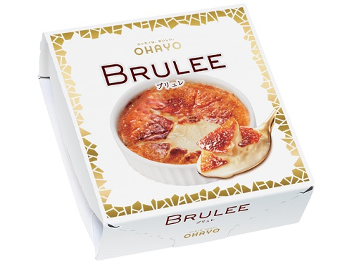
  설탕을 토치로 그을려 바삭하게 얼린 캐러멜 층과 안쪽의 진한 바닐라 커스터드 아이스크림의 고급스러운 조화.
- **몽고탄멘 나카모토 (매운 라멘)**
  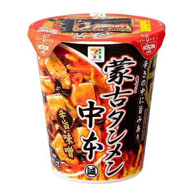
  얼큰하고 자극적인 맛을 좋아하는 한국인의 입맛에 딱 맞춘 해장용 원탑 매운 컵라면.
- **부타가쿠니 (돼지고기 삼겹 조림)**
  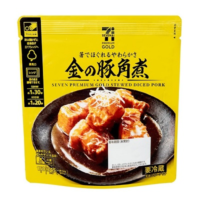
  삼겹살 고기를 푹 졸여내어 입안에서 부드럽게 사르르 풀어지는 간장 조림 안주.
- **낫토 초밥 (낫토 호소마키)**
  낫토를 김과 초밥 밥으로 돌돌 말아놓아 한 입에 먹기 편하게 포장된 롤김밥.
- **반숙란 (아지츠케 타마고)**
  노른자가 쫀득하고 짭조름하게 간이 완벽히 배어 있는 온천 계란.
- **오뎅 (카운터 어묵 바)**
  카운터 냄비에서 푹 끓고 있어 시원한 육수가 깊게 밴 무, 곤약, 유부 주머니 등 편의점 명물 오뎅.

---

### 🧪 여행용 편의점 특급 꿀조합템
- 💩 **[쾌변 보장 조합] 파이브미니 + 곤약젤리**
  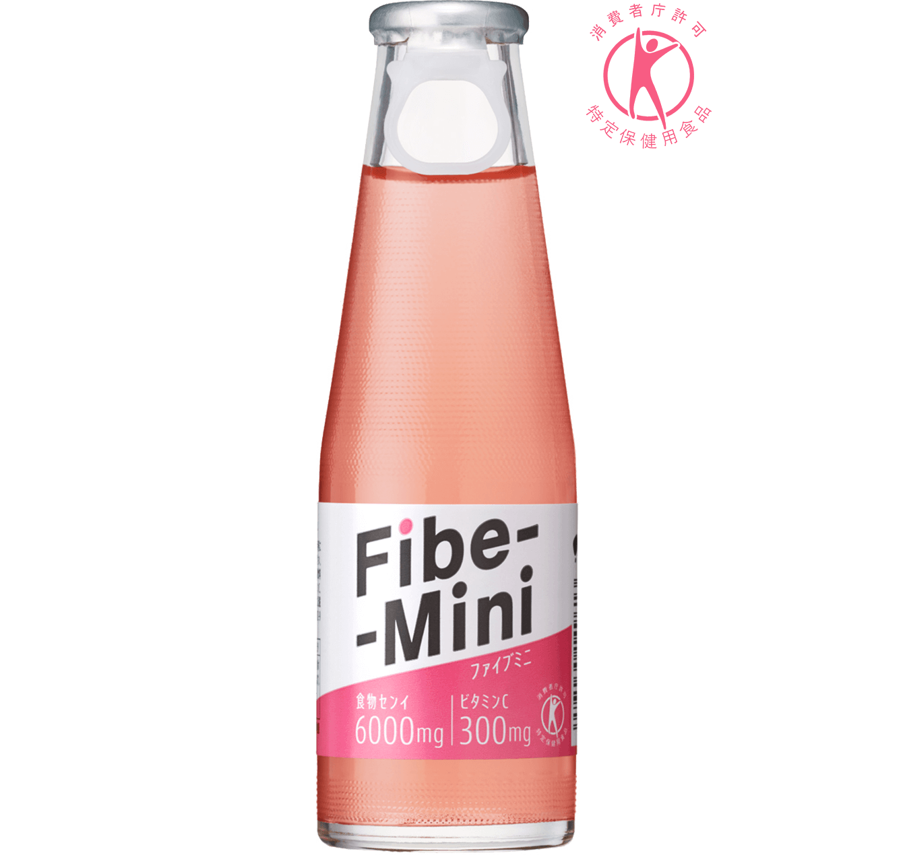 + 
  여행 중 밀가루와 고기 위주 식사로 더부룩한 배를 시원하게 뚫어줄 식이섬유 가득한 파이브미니 음료와 곤약 젤리 조합입니다. 아침 공복에 함께 섭취하면 상쾌한 하루를 도울 수 있습니다.
- 🔋 **[피로 회복 조합] 무쿠미(붓기) 해소 음료 + 에너지 젤리**
  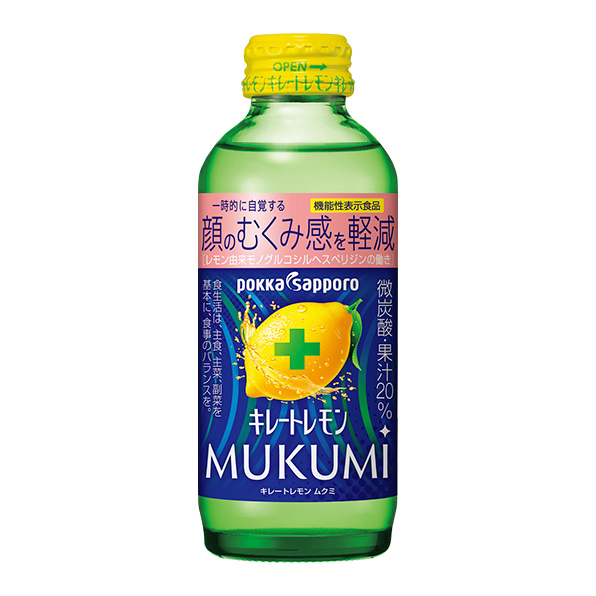 + 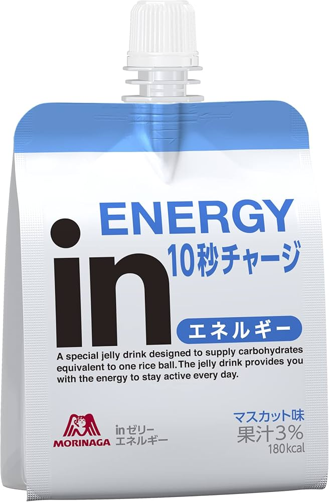
  하루 2만 보 이상 걷는 전신 피로와 붓기를 날려줄 조합. 체내 나트륨 및 수분 배출을 돕는 무쿠미(붓기) 음료나 차로 다리의 순환을 돕고, 비타민과 타우린이 든 급속 흡수 에너지 젤리로 기운을 즉시 충전합니다.

---

## 🍱 구글지도에 저장하신 위시리스트 추천 맛집 리스트
가족들과 함께 가실 수 있도록, 구글지도에서 추출한 카테고리별 위시리스트 맛집 목록을 정리했습니다. 일정 동선과 밀접하여 언제든지 활용 가능합니다!

### 🥩 스키야키 / 야끼니꾸
* **[스키야키] 스키야키 호쿠토**: [구글지도 ➔](https://www.google.com/maps/search/?api=1&query=Sukiyaki+Hokuto+Osaka) | 난바역 인근, 정통 간장 양념의 고급 스키야키
* **[스키야키] 니혼바시 츠루야**: [구글지도 ➔](https://www.google.com/maps/search/?api=1&query=Sukiyaki+Shabushab+Nihonbashi+Tsuruya+Osaka) | 니혼바시 인근, 깔끔하고 조용한 스키야키 전문점
* **[야끼니꾸] 야키니쿠 리키마루 도톤보리점**: [구글지도 ➔](https://www.google.com/maps/search/?api=1&query=Yakiniku+Rikimaru+Dotonbori+Osaka) | 고품질 소고기 무한리필(예약 권장)
* **[야끼니꾸] Yakiniku Lab Umeda**: [구글지도 ➔](https://www.google.com/maps/search/?api=1&query=Yakiniku+Lab+Umeda+Osaka) | 우메다 인근 트렌디한 야끼니꾸 맛집

### 🍤 쿠시카츠 / 오코노미야끼
* **[쿠시카츠] 야에카츠**: [구글지도 ➔](https://www.google.com/maps/search/?api=1&query=Yaekatsu+Osaka) | 신세카이(츠텐카쿠) 인근, 원조 바삭한 꼬치 튀김
* **[쿠시카츠] 꼬치카츠 시로타야**: [구글지도 ➔](https://www.google.com/maps/search/?api=1&query=Kushikatsu+Shirotaya+Dotonbori+Osaka) | 도톤보리 내 위치, 한국어 메뉴판 완비
* **[오코노미야끼] 아지노야 오코노미야끼**: [구글지도 ➔](https://www.google.com/maps/search/?api=1&query=Ajinoya+Okonomiyaki+Osaka) | 난바 인근, 오랜 역사의 양배추 듬뿍 오코노미야끼
* **[오코노미야끼] 후쿠타로 본점**: [구글지도 ➔](https://www.google.com/maps/search/?api=1&query=Fukutaro+Namba+Osaka) | 난바 난카이 빌딩 인근, 네기야끼(파전 스타일) 명가

### 🍣 스시 (초밥) / 장어덮밥 (우나기)
* **[스시] 타치스시 마구로 잇테츠**: [구글지도 ➔](https://www.google.com/maps/search/?api=1&query=Tachisushi+Maguro+Ittetsu+Sennichimae+Osaka) | 참치 초밥 및 싱싱한 활어회가 유명한 로컬 맛집
* **[스시] 카미나리 스시**: [구글지도 ➔](https://www.google.com/maps/search/?api=1&query=Kaminari+Sushi+Osaka) | 조용하고 아담한 분위기의 정통 판스시 전문점
* **[스시] 우오신 센니치마에점**: [구글지도 ➔](https://www.google.com/maps/search/?api=1&query=Uoshin+Sennichimae+Osaka) | 큼직한 네타(생선회)가 올라가서 눈과 입이 즐거운 식당
* **[장어덮밥] 장어의 나카쇼 신사이바시점**: [구글지도 ➔](https://www.google.com/maps/search/?api=1&query=Unagi+no+Nakasho+Shinsaibashi+Osaka) | 정통 나고야식 히츠마부시 장어덮밥 전문점
* **[장어덮밥] 우나기야 카도 난바점**: [구글지도 ➔](https://www.google.com/maps/search/?api=1&query=Unagiya+Kado+Namba+Osaka) | 난바 근처의 맛있는 장어 전문 로컬 맛집

### 🍜 우동 / 라멘 / 타코야끼
* **[우동] 츠루통탄 소에몬쵸점**: [구글지도 ➔](https://www.google.com/maps/search/?api=1&query=Tsurutontan+Soemoncho+Osaka) | 커다란 그릇에 나오는 쫄깃한 면발 och 진한 국물 우동
* **[라멘] 잇푸도 라멘 난바점**: [구글지도 ➔](https://www.google.com/maps/search/?api=1&query=Ippudo+Namba+Osaka) | 깊고 뽀얀 국물의 돈코츠 라멘
* **[타코야끼] 타코야키 도라쿠 와나카 본점**: [구글지도 ➔](https://www.google.com/maps/search/?api=1&query=Takoyaki+Doraku+Wanaka+Sennichimae+Osaka) | 겉바속촉 정석 (그릇거리 인근)
* **[타코야끼] 야키소바 쿠쿠루 본점**: [구글지도 ➔](https://www.google.com/maps/search/?api=1&query=Takoya+Dotonbori+Kukuru+Main+Store+Osaka) | 입에서 살살 녹는 식감 (도톤보리 한복판)
* **[타코야끼] 아이즈야 덴포잔점**: [구글지도 ➔](https://www.google.com/maps/search/?api=1&query=Aizuya+Tempozan+Osaka) | 소스 없이 먹는 원조 타코야끼 (덴포잔)

### 🍺 이자카야 / 야키토리 / 디저트
* **[야키토리] 숯불구이 유지로**: [구글지도 ➔](https://www.google.com/maps/search/?api=1&query=炭焼きゆうじろう+Sennichimae+Osaka) | KOKO 호텔 뒤편 숯불 야키토리 전문 로컬 이자카야
* **[야키토리] 사사야 난바점**: [구글지도 ➔](https://www.google.com/maps/search/?api=1&query=Sasaya+Namba+Sennichimae+Osaka) | 닭 특수부위 구이 및 맥주 한잔하기 좋은 이자카야
* **[디저트] 하브스 난바파크스점**: [구글지도 ➔](https://www.google.com/maps/search/?api=1&query=HARBS+Namba+Parks+Osaka) | 제철 과일이 듬뿍 든 밀크 크레이프 조각 케이크 명소
